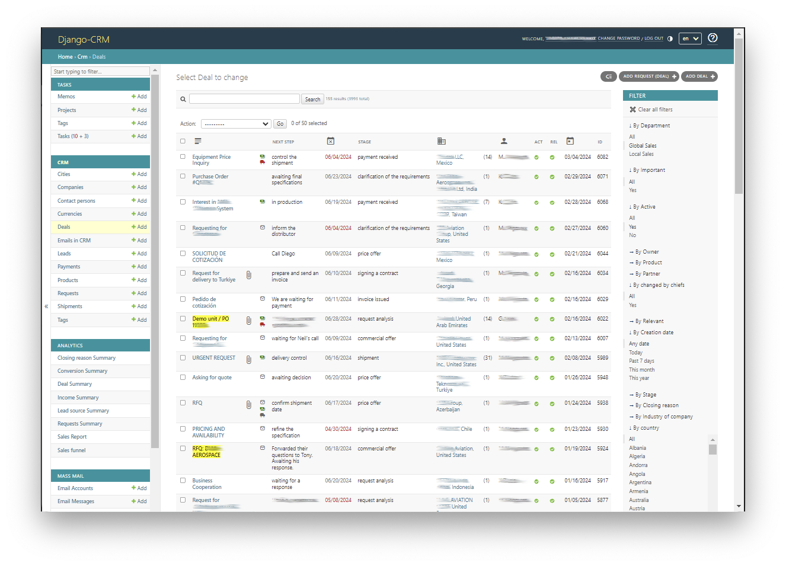
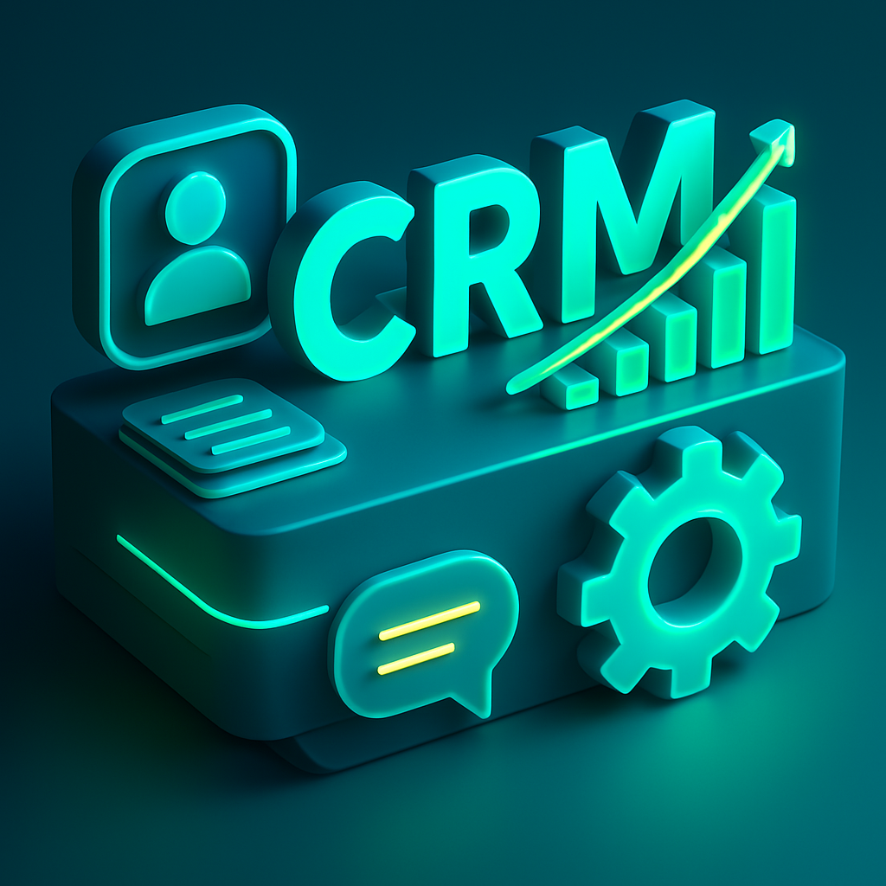
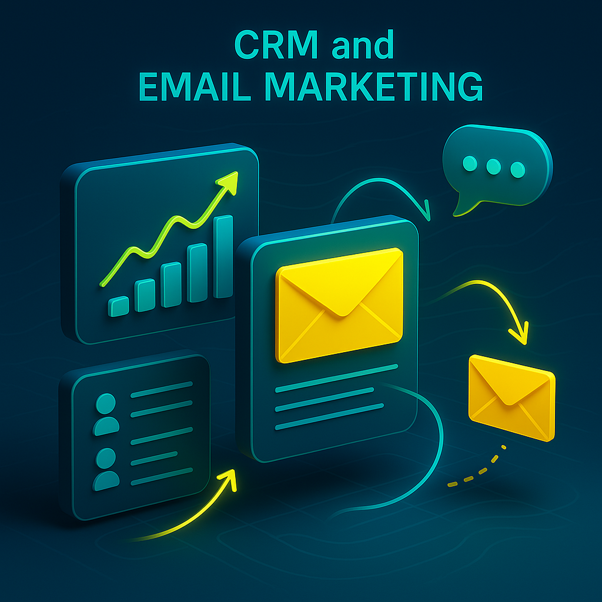

---
hide:
  - navigation
  - toc
title: Free & Open-Source CRM App Software
description: Analytical CRM offers contact management, sales tracking, email marketing, and more. Customize your workflow and keep your data secure – no vendor lock-in!

---
## What Makes Django CRM Different?

**Django-CRM** is a customer relationship management CRM solution designed with **two primary goals**:

- **For users**: Deliver enterprise-level open-source CRM software with a comprehensive suite of business solutions.  
- **For developers**: Simplify the processes of development, customization, and production server support.

**The proprietary framework was not intentionally created**: everything is built using the popular Django framework.  
CRM also takes full advantage of the Django Admin site, with documentation all contained on a single web page!  
Client Relationship Management software is built for individual use by businesses of any size or freelancers and is designed to provide easy customization and quick development. Access to the company's business data remains solely under its control.  
**Django-CRM is ideal for businesses that want full control over their CRM solution without vendor lock-in.**

---

<figure markdown="span">
  { loading=lazy width="680"}
  <figcaption>Screenshot of the deals page in CRM</figcaption>
</figure>

Over time, CRM systems inevitably **accumulate large volumes of data** across leads, contacts, tasks, and interactions. A **tabular presentation** with flexible filtering and sorting options helps users **quickly locate relevant records**, analyze key details, and manage daily operations efficiently—even as the dataset grows. This format supports faster decision-making and reduces the time spent navigating complex information.

<figure markdown="span">
  { loading=lazy }
  <figcaption>Pagination of deals</figcaption>
</figure>

---

## Comprehensive features of CRM software

- :material-contacts-outline: **[Contact Management]** – Store and manage customer information, interactions, and activities
- :material-account-cash-outline: **[Sales Tracking]** – Track leads, opportunities, and deals to improve sales performance
- :material-clipboard-check-multiple-outline: **[Task Organization]** – Create and assign tasks to team members for better collaboration and productivity
- :material-finance: **[Analytics]** – Generate reports and analyze data to make informed business decisions
- :material-email-fast-outline: **[Email Integration & Mailing]** – Send and receive emails directly from the CRM for seamless communication
- :material-translate: **[Project Localization]** – Customer service software is now **available in 20+ languages**

  [Contact Management]: features/crm-app-features.md#company-contact-lead-management
  [Sales Tracking]: features/crm-app-features.md
  [Task Organization]: features/tasks-app-features.md
  [Analytics]: features/analytics-app-features.md
  [Email Integration & Mailing]: features/massmail-app-features.md
  [Project Localization]: index.md

---

## CRM Application Software

{ align=left width="600" loading=lazy style="clip-path: xywh(0 5px 100% 100% round 15% 0);"}
{ .card }

 Django-CRM is a free, open-source customer relationship management app built on the Django framework, designed to help businesses manage their sales pipeline and customer data more efficiently. This CRM software app centralizes key processes—such as: lead tracking, deal management, and internal communication—into a single, streamlined system.  
With features like **role-based access** control, advanced search filters, integrated email and **VoIP communication**, and automatic request handling, it supports teams in working collaboratively and staying organized. The CRM application also enables users to track payments, manage tasks, and gain insights through built-in analytics and sales funnel reports.  
**Custom roles** and permissions make it adaptable to any organizational structure, ensuring each user has the right level of access. Whether you're handling commercial requests, managing contacts, or analyzing sales performance, Django-CRM helps **automate** and simplify your **workflow**. As a flexible and fully documented solution, it’s ideal for companies looking to deploy a scalable and customizable CRM software app without vendor lock-in.
{ .card }

---

## Easy project customization and development

Django-CRM is built with flexibility in mind, making it easy to customize and extend for any business need. Whether you're adding new features, integrating third-party services, or modifying existing workflows, the codebase is easy to understand and extend.  
As a Python CRM, it leverages Django’s powerful framework to ensure rapid development and straightforward integration with third-party tools. With reusable components and clear documentation, adapting the CRM to your unique business logic takes minimal effort.  
Developers can add new features, adjust workflows, or connect external APIs without unnecessary complexity. The project follows Django best practices, making it simple to maintain and upgrade. With clear documentation and active community support, getting started is quick and efficient.

---

## CRM and Email Marketing

 Django-CRM combines powerful customer management tools with **built-in email marketing capabilities**, making it a complete [**mailing CRM**](features/massmail-app-features.md) solution. Users can run personalized email campaigns, manage subscriber lists, and track engagement—all from within the CRM interface. Emails are linked directly to companies, contact persons, and lead, ensuring a unified communication history. Bulk mailing features allow **targeted newsletters** without relying on external tools.  
Advanced **customer segmentation** enables precise targeting based on user-defined filters. With automatic email synchronization and ticket-based tracking, you can maintain consistent customer communication at scale. As a **CRM with email** functionality, Django-CRM simplifies outreach while keeping your team aligned on every touchpoint.
{ .card }

<figure markdown="span">
{ align=left width="600" loading=lazy style="clip-path: xywh(0 5px 100% 100% round 15% 0);"}
</figure>

---
